* Table of Contents
{:toc}

--------------------------------------------------------------------------------------------------------------------

## **Acknowledgements**

* {list here sources of all reused/adapted ideas, code, documentation, and third-party libraries -- include links to the original source as well}

--------------------------------------------------------------------------------------------------------------------

## **Setting up, getting started**

Refer to the guide [_Setting up and getting started_](SettingUp.md).

--------------------------------------------------------------------------------------------------------------------

## **Design**

:bulb: **Tip:** The `.puml` files used to create diagrams in this document `docs/diagrams` folder. Refer to the [_PlantUML Tutorial_ at se-edu/guides](https://se-education.org/guides/tutorials/plantUml.html) to learn how to create and edit diagrams.

### Architecture

The ***Architecture Diagram*** given above explains the high-level design of the App.

Given below is a quick overview of main components and how they interact with each other.

**Main components of the architecture**

**`Main`** (consisting of classes [`Main`](https://github.com/se-edu/addressbook-level3/tree/master/src/main/java/seedu/address/Main.java) and [`MainApp`](https://github.com/se-edu/addressbook-level3/tree/master/src/main/java/seedu/address/MainApp.java)) is in charge of the app launch and shut down.
* At app launch, it initializes the other components in the correct sequence, and connects them up with each other.
* At shut down, it shuts down the other components and invokes cleanup methods where necessary.

The bulk of the app's work is done by the following four components:

* [**`UI`**](#ui-component): The UI of the App.
* [**`Logic`**](#logic-component): The command executor.
* [**`Model`**](#model-component): Holds the data of the App in memory.
* [**`Storage`**](#storage-component): Reads data from, and writes data to, the hard disk.

[**`Commons`**](#common-classes) represents a collection of classes used by multiple other components.

**How the architecture components interact with each other**

The *Sequence Diagram* below shows how the components interact with each other for the scenario where the user issues the command `delete 1`.

Each of the four main components (also shown in the diagram above),

* defines its *API* in an `interface` with the same name as the Component.
* implements its functionality using a concrete `{Component Name}Manager` class (which follows the corresponding API `interface` mentioned in the previous point.

For example, the `Logic` component defines its API in the `Logic.java` interface and implements its functionality using the `LogicManager.java` class which follows the `Logic` interface. Other components interact with a given component through its interface rather than the concrete class (reason: to prevent outside component's being coupled to the implementation of a component), as illustrated in the (partial) class diagram below.

The sections below give more details of each component.

### UI component

The **API** of this component is specified in [`Ui.java`](https://github.com/se-edu/addressbook-level3/tree/master/src/main/java/seedu/address/ui/Ui.java)

The UI consists of a `MainWindow` that is made up of parts e.g.`CommandBox`, `ResultDisplay`, `PersonListPanel`, `AppointmentListPanel`, `StatusBarFooter` etc. All these, including the `MainWindow`, inherit from the abstract `UiPart` class which captures the commonalities between classes that represent parts of the visible GUI.

The `UI` component uses the JavaFx UI framework. The layout of these UI parts are defined in matching `.fxml` files that are in the `src/main/resources/view` folder. For example, the layout of the [`MainWindow`](https://github.com/AY2324S2-CS2103T-T15-1/tp/blob/master/src/main/java/seedu/address/ui/MainWindow.java) is specified in [`MainWindow.fxml`](https://github.com/AY2324S2-CS2103T-T15-1/tp/blob/master/src/main/resources/view/MainWindow.fxml)

The `UI` component,

* executes user commands using the `Logic` component.
* listens for changes to `Model` data so that the UI can be updated with the modified data.
* keeps a reference to the `Logic` component, because the `UI` relies on the `Logic` to execute commands.
* depends on some classes in the `Model` component, as it displays `Person` (`Doctor` or `Patient`) and `Appointment` objects residing in the `Model`.

### Logic component

**API** : [`Logic.java`](https://github.com/AY2324S2-CS2103T-T15-1/tp/tree/master/src/main/java/seedu/address/logic/Logic.java)

Here's a (partial) class diagram of the `Logic` component:

The sequence diagram below illustrates the interactions within the `Logic` component, taking `execute("delete 1")` API call as an example.

:information_source: **Note:** The lifeline for `DeleteCommandParser` should end at the destroy marker (X) but due to a limitation of PlantUML, the lifeline continues till the end of diagram.

How the `Logic` component works:

1. When `Logic` is called upon to execute a command, it is passed to an `AddressBookParser` object which in turn creates a parser that matches the command (e.g., `AddDoctorCommandParser`) and uses it to parse the command.
1. This results in a `Command` object (more precisely, an object of one of its subclasses e.g., `AddDoctorCommand`) which is executed by the `LogicManager`.
1. The command can communicate with the `Model` when it is executed (e.g. to add a doctor). 
   Note that although this is shown as a single step in the diagram above (for simplicity), in the code it can take several interactions (between the command object and the `Model`) to achieve.
1. The result of the command execution is encapsulated as a `CommandResult` object which is returned back from `Logic`.

Here are the other classes in `Logic` (omitted from the class diagram above) that are used for parsing a user command:

How the parsing works:
* When called upon to parse a user command, the `AddressBookParser` class creates an `XYZCommandParser` (`XYZ` is a placeholder for the specific command name e.g., `AddCommandParser`) which uses the other classes shown above to parse the user command and create a `XYZCommand` object (e.g., `AddCommand`) which the `AddressBookParser` returns back as a `Command` object.
* All `XYZCommandParser` classes (e.g., `AddCommandParser`, `DeleteCommandParser`, ...) inherit from the `Parser` interface so that they can be treated similarly where possible e.g, during testing.

### Model component
**API** : [`Model.java`](https://github.com/se-edu/addressbook-level3/tree/master/src/main/java/seedu/address/model/Model.java)

The `Model` component,

* stores the address book data i.e., all `Person` derivative objects (which are contained in a `UniquePersonList` object) and
* all `Appointment` objects (which are contained in a `UniqueAppointmentList` object)
* stores the currently 'selected' `Person` objects (e.g., results of a search query, either a `Patient` or `Doctor` instance) and `Appointment` object (e.g results of an query) as a separate _filtered_ list which is exposed to outsiders as an unmodifiable `ObservableList<Person>` and `ObservableList<Appointment>` that can be 'observed' e.g. the UI can be bound to this list so that the UI automatically updates when the data in the list change.
* stores a `UserPref` object that represents the user’s preferences. This is exposed to the outside as a `ReadOnlyUserPref` objects.
* does not depend on any of the other three components (as the `Model` represents data entities of the domain, they should make sense on their own without depending on other components)

:information_source: **Note:** For a clearer Class Diagram image, please refer to the handdrawn version below, it is exactly the same as the Class Diagram generated above, only drawn with straight lines for clarity and neatness. 

### Storage component

**API** : [`Storage.java`](https://github.com/se-edu/addressbook-level3/tree/master/src/main/java/seedu/address/storage/Storage.java)

The `Storage` component,
* can save both address book data and user preference data in JSON format, and read them back into corresponding objects.
* inherits from both `AddressBookStorage` and `UserPrefStorage`, which means it can be treated as either one (if only the functionality of only one is needed).
* depends on some classes in the `Model` component (because the `Storage` component's job is to save/retrieve objects that belong to the `Model`)

### Common classes

Classes used by multiple components are in the `seedu.addressbook.commons` package.

--------------------------------------------------------------------------------------------------------------------

## **Implementation**

This section describes some noteworthy details on how certain features are implemented.

### Add a `Patient` or `Doctor`
<i><b>Note</b>: Add `patient` and `doctor` has been grouped together as they are very similar in implementation. 
This reduces repetition of information and increases clarity.</i>

Adds a new `Patient` or `Doctor` entry by indicating their `NRIC`, `Name`, `DoB`, and `Phone`.
This command is implemented through the `AddPatientCommand` for patient and `AddDoctorCommand` for doctor class which both extend the `Command` class.

* Step 1. User enters an `addpatient` or `adddoctor` command.
* Step 2. The `AddressBookParser` will call `parseCommand` on the user's input string and return an instance of `addPatientCommandParser` or `addDoctorCommandParser`.
* Step 3. The `parse` command in `addPatientCommandParser` or `addDoctorCommandParser` calls `ParserUtil` to create instances of objects for each of the fields.
  * If there are any missing fields, a `CommandException` is thrown.
  * If input arguments does not match contraints for the fields, a `IllegalArgumentException` is thrown.
  * If the patient to added already exists in the system, a `DuplicatePersonException` is thrown`.

The activity diagram below demonstrates this error handling process in more detail.

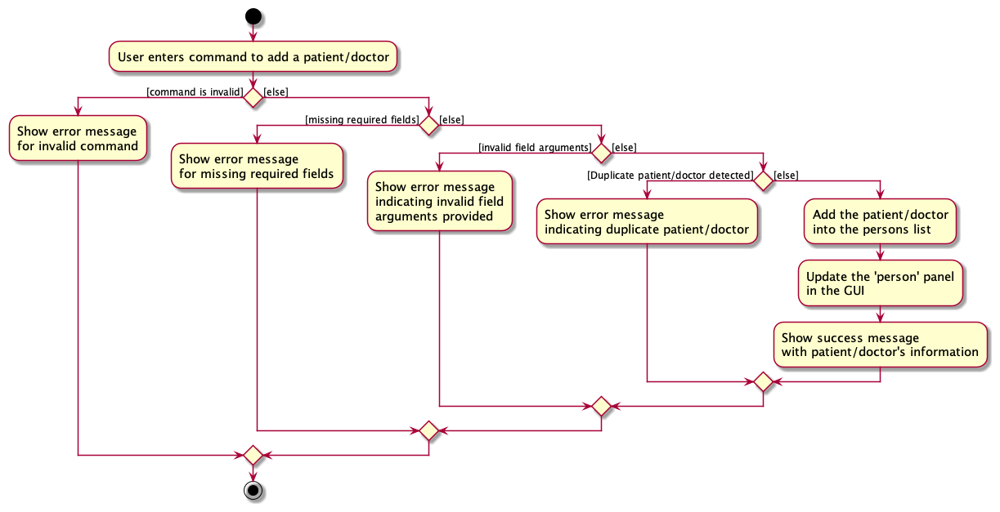

* Step 4. The `parse` command in `addPatientCommandParser` or `addDoctorCommandParser` return an instance of either `addPatientCommand` or `addDoctorCommand`.
* Step 5. The `LogicManager` calls the `execute` method in `addPatientCommand` or `addDoctorCommand`.
* Step 6. The `execute` method in `addPatientCommand` or `addDoctorCommand` executes and calls `addPerson` in model to add the new patient into the system.
* Step 7. Success message gets printed onto the results display to notify user.

The sequence diagram below closely describes the interaction between the various components during the execution of the `AddPatientCommand`.

<i>Note: Sequence diagram above is the same for `AddDoctorCommand`, but instead of `AddPatientCommandParser` it is `AddDoctorCommandParser` etc.</i>

#### Design considerations:

**Aspect: How editing a Person works:**

* **Alternative 1 (current choice):** Removes the `originalPerson` and adds the `editedPerson`.
    * Pros: Retains the sorted order of Persons by `Name` in the person list.
    * Cons: May have performance issues in terms of time complexity since it requires 2 operations (`deletePerson()` and `addPerson`).

* **Alternative 2:** Directly update the fields in the `originalPerson`
    * Pros: Better performance, since this only requires searching through the person list once.
    * Cons: The order of person list will be lost, since `Name` of a `Person` may be edited.

### Edit `doctor` or `patient`

Edits a `doctor` or `patient` entry by indicating their `Index`.
This command is implemented through the `EditCommand` class which extends the `Command` class.

* Step 1. User enters an `edit` command.
* Step 2. The `AddressBookParser` will call `parseCommand` on the user's input string and return an instance of `editCommandParser`.
* Step 3. The `parse` command in `editCommandParser` calls `ParserUtil` to create instances of objects for each of the fields.
    * If there are any missing fields, a `CommandException` is thrown.
    * If input arguments does not match contraints for the fields, a `IllegalArgumentException` is thrown.
    * If the provided `index` is invalid, a `CommandException` is thrown.

The activity diagram below demonstrates this error handling process in more detail.

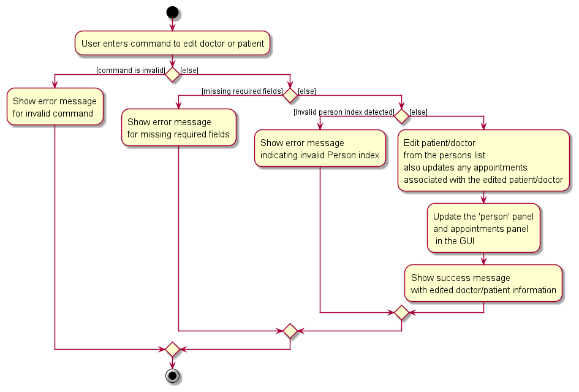

* Step 4. The `parse` command in `editCommandParser` return an instance of `editCommand`.
* Step 5. The `LogicManager` calls the `execute` method in `editCommand`.
* Step 6. The `execute` method in `editCommand` executes and creates a new edited person.
* Step 6. The `execute` method in `editCommand` calls the `setPerson` in model to update the details of the respective person.
* Step 7. The `execute` method in `editCommand` also iterates through the `ObservableList<Appointments>` and retrieves all appointments that have the person to be edited, and calls the `setDoctorNric` or `setPatientNric` methods to update all relevant appointments related to the patient or doctor.
* Step 8. Success message gets printed onto the results display to notify user.

The sequence diagram below closely describes the interaction between the various components during the execution of the `EditCommand`.

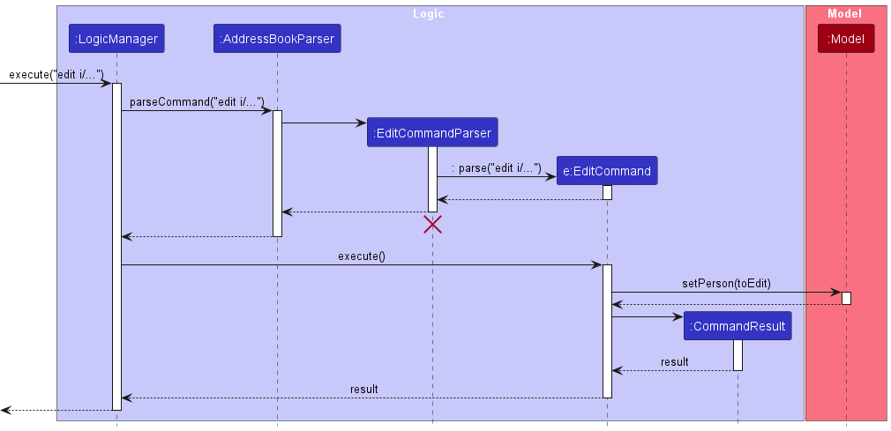

Why is this implemented this way?
1. Making both `Doctor` and `Patient` class extend the `Person` class makes it easier to execute edit operations.
2. `Doctor` and `Patient` all exhibit similar qualities, and thus can inherit from the `Person` superclass.
3. Eliminates the need for separate edit commands for doctor and patient.
4. Since appointments are constructed with unique `Person` `Nric` fields, it does not make sense to have an appointment that does not have valid or outdated doctor or patient entries.
5. As such, the solution that is inbuilt to editing a `Person`, comes with the added functionality on the backend to augment all related `Appointment` entries as well.
6. This results in an updated `Appointments` panel, and saves the user from the hassle of needing to manually edit outdated `Appointment` entries one by one.

### Delete `doctor` or `patient`

Deletes a `doctor` or `patient` entry by indicating their `Index`.
This command is implemented through the `DeleteCommand` class which extends the `Command` class.

* Step 1. User enters an `delete` command.
* Step 2. The `AddressBookParser` will call `parseCommand` on the user's input string and return an instance of `deleteCommandParser`.
* Step 3. The `parse` command in `deleteCommandParser` calls `ParserUtil` to create instances of objects for each of the fields.
    * If there are any missing fields, a `CommandException` is thrown.
    * If input arguments does not match contraints for the fields, a `IllegalArgumentException` is thrown.
    * If the provided `index` is invalid, a `CommandException` is thrown.

The activity diagram below demonstrates this error handling process in more detail.

* Step 4. The `parse` command in `deleteCommandParser` return an instance of `deleteCommand`.
* Step 5. The `LogicManager` calls the `execute` method in `deleteCommand`.
* Step 6. The `execute` method in `deleteCommand` executes and calls `deletePerson` in model to remove doctor or patient from the system.
* Step 7. The `execute` method in `deleteCommand` also iterates through the `ObservableList<Appointments>` and retrieves all appointments that have the person to be deleted, and calls the `deleteAppointmentCommand` as well.
* Step 8. Success message gets printed onto the results display to notify user.

The sequence diagram below closely describes the interaction between the various components during the execution of the `DeleteCommand`.

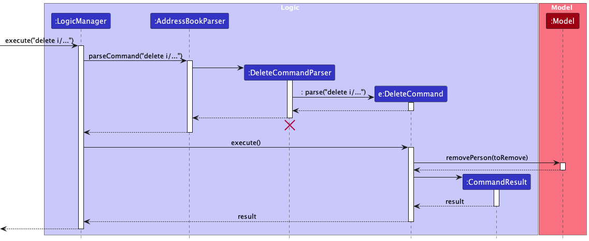

Why is this implemented this way?
1. Making both `Doctor` and `Patient` class extend the `Person` class makes it easier to execute delete operations.
2. `Doctor` and `Patient` all exhibit similar qualities, and thus can inherit from the `Person` superclass.
3. Eliminates the need for separate delete commands for doctor and patient.
4. Since appointments are constructed with unique `Person` `Nric` fields, it does not make sense to have an appointment that does not have valid doctor or patient entries.
5. As such, the solution that is inbuilt to deleting a `Person`, comes with the added functionality on the backend to delete all related `Appointment` entries as well.
6. This results in a cleaner `Appointments` panel, and saves the user from the hassle of needing to delete unwanted `Appointment` entries one by one.

### Appointments: A new entity type
MediCLI offers support for appointments, represented by the `Appointment` class on top of existing support for Doctors and Patients. 
At the crux of it, an appointment simply encompasses the NRICs of a Patient and a Doctor, along with an appointment date & time. 

The diagram below displays the structure of the `Appointment` class.
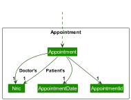

As visible, the appointment class consists of a doctor's NRIC number, a patient's NRIC number, and a appointment date, each represented by its own class.

Below is an object diagram demonstrating a possible appointment object and its relations with objects that it contains.
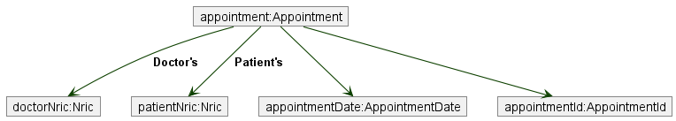

In the object diagram you see that two instances of the Nric class have been instantiated, one as doctorNric, and one as patientNric. This of course is along with the appointmentDate object.

#### Context and thought process behind implementation:
Implementing Appointments naturally involved many design decisions, and here we have attempted to outline the thought process behind our current implementation:
* One key focus of the appointment implementation was to keep it as similar to the implementation of patients and doctors.
* The idea is that at the end of the day, the appointment is simply another type of entry being tracked.
* Nevertheless, looking at it from a UI perspective, we would want to differentiate the appointment entries from the person entries.
* Hence, while similar in terms of the code and functionality, a lot of the infrastructure to handle appointments was built parallel to the one for persons.
* For instance, there is a separate `UniqueAppointmentList` class for storing and manipulating appointments that functions very similar to the equivalent list for persons.

#### Implementation and justification:
* Based on the thought process, the approach was to ensure MediCLI had the same way of handling Appointments and persons.
* The overall structure including how appointments are stored, managed etc. is largely similar to support debugging and improve readability and comprehension.
* In other words, if you understand how MediCLI manages persons, you will also understand how it manages appointments.
* Some differences are however inevitable and have been listed below:
  * Appointments have doctor NRIC, patient NRIC, and a Appointment Date as attributes. A doctor and patient with the corresponding nric number must already exist before the appointment was created, and the date must be >= current date.
  * Each appointment is also assigned a unique appointmentId. This is because while patients and doctors use NRIC as a unique identifier, appointments do not have one, hence the auto generated appoitnmentId. There is a util file to achieve this called 'idutil.java'.
    * Each appointmentId is structured as `aXXXXXXXX` where each `X` is a number. The idUtil stores used numbers to ensure no duplicates are created.
  * The appointments are stored in a separate list called the `UniqueAppointmentList`, to allow for different operations and flexibility down the line.
  * In terms of the UI, the appointments appear in a separate column to ensure that the user is able to clearly distinguish between them.

#### Alternatives considered
* One key alternative we looked at was implementing the appointment as part of the same list i.e. `UniquePersonList`.
* This would mean changing the `person` class to a different one such as `entry` and have all three of `patient` , `doctor` and `appointment` extend from the `entry` class.
* We decided against this because we thought that it was not the most OOP friendly solution and just didn't feel right or justifiable.
* Furthermore, it might get confusing for the user if everything was dumped into the same list of them to sieve through. Perhaps the user was only concerned with looking up patients in which case the appointments would simply be added clutter.
* The increased level of integration would also be problems for implementation and testing as existing functionality would have to be adapated exposing the system to more risks and potential for bugs. Eg: the classes would have to change from `Person` to `Entry` in a number of different places.

### Add a `Appointment`

Adds a new `Appointment` entry by indicating the `patientNric`, `doctorNric`, and an `appointmentDate`.
The values stored in each of these attributes are self explanatory. A key thing to note is that patients/doctors with the NRIC number must already exist in the records, and the date must be in the future.

This command is implemented through the `AddAppointmentCommand` class which extend the `Command` class.

* Step 1. User enters the keyword and attributes necessary for adding an appointment as indicated above.
* Step 2. The `AddressBookParser` will call `parseCommand` on the user's input string and return an instance of `addAppointmentCommandParser`.
* Step 3. The `parse` command in `addPatientCommandParser` calls `ParserUtil` to create instances of objects for each of the fields.
    * If there are any missing fields, a `CommandException` is thrown.
    * If input arguments does not match constraints for the fields, a `IllegalArgumentException` is thrown.
    * If the doctor/patient does not exist or the date is not >= current date, a `InvalidAppointmentException` is thrown
    * If an appointment between the doctor and patient on the specified date already exists, then a `DuplicateAppointmentException` is thrown.

The activity diagram below demonstrates this error handling process in more detail.
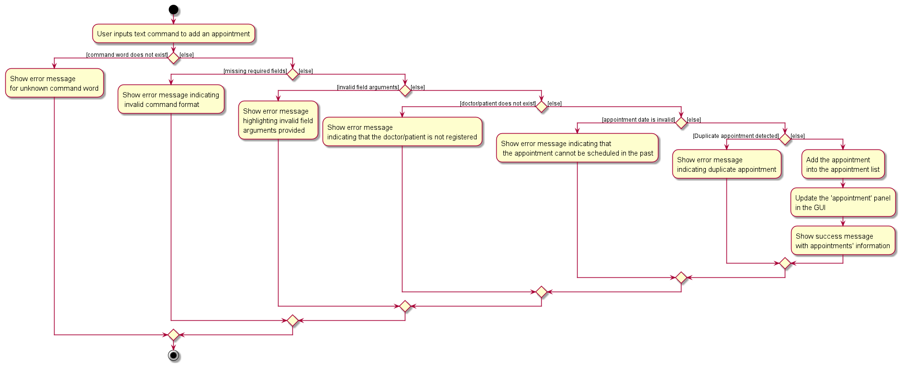

* Step 4. The `parse` command in `addAppointmentCommandParser` return an instance of `addAppointmentCommand`.
* Step 5. The `LogicManager` calls the `execute` method in `addAppointmentCommand`.
* Step 6. The `execute` method in `addAppointmentCommand` executes and calls `addAppointment` in model to add the new appointment into the system.
* Step 7. Success message gets printed onto the results display to notify user.

The sequence diagram below closely describes the interaction between the various components during the execution of the `AddAppointmentCommand`.

As mentioned earlier, appointments can only be added if a set of robust checks is passed. Below is an activity diagram demonstrating the appointment checking processes as part of the execution of the `execute` method in an `addAppointmentCommand` object.

### Edit `Appointment`
Edits an `Appointment` entry by indicating their `Index`.
This command is implemented through the `EditAppointmentCommand` class which extends the `Command` class.

* Step 1. User enters an `editappt` command.
* Step 2. The `AddressBookParser` will call `parseCommand` on the user's input string and return an instance of `editAppointmentCommandParser`.
* Step 3. The `parse` command in `editAppointmentCommandParser` calls `ParserUtil` to create instances of objects for each of the fields.
  * If there are any missing fields, a `CommandException` is thrown.
  * If input arguments does not match contraints for the fields, a `IllegalArgumentException` is thrown.
  * If the provided `index` is invalid, a `CommandException` is thrown.

The activity diagram below demonstrates this error handling process in more detail.

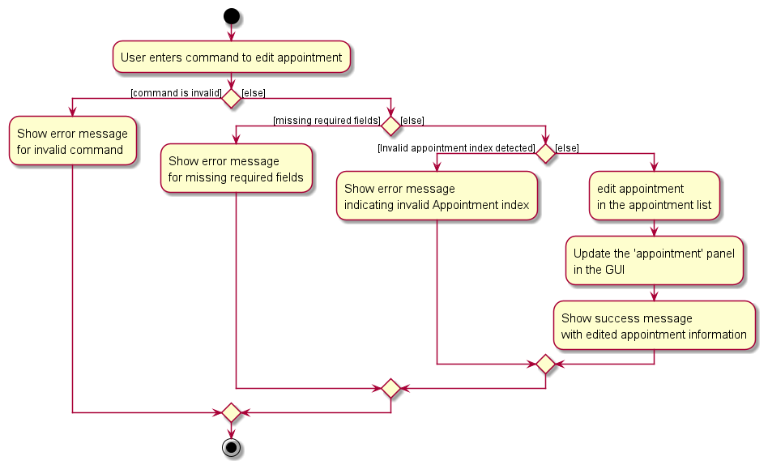

* Step 4. The `parse` command in `editAppointmentCommandParser` returns an instance of `editAppointmentCommand`.
* Step 5. The `LogicManager` calls the `execute` method in `editAppointmentCommand`.
* Step 6. The `execute` method in `editAppointmentCommand` executes and calls `setAppointment` in model to set an updated appointment into the system.
* Step 7. Success message gets printed onto the results display to notify user.

The sequence diagram below closely describes the interaction between the various components during the execution of the `EditAppointmentCommand`.

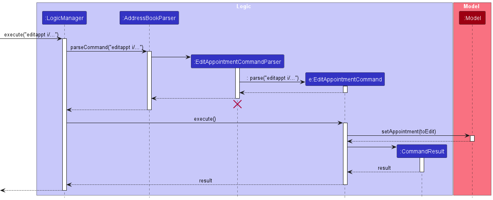

Why is this implemented this way?
1. The `Appointment` class has very similar functionalities to that of the `Person` class, in which both classes deal with edit operations.
2. Furthermore on the UI, the `Appointment` column runs parallel to the `Person` column, as such, the behaviours (UX) of operating on the `Person` panel should have a similar feel and experience when dealing with `Appointment` objects.
3. This parallelism is also reflected in the backend code, and hence is very similar to how editing a `Person` is implemented - this is mostly seen through the naming conventions of the classes related to `EditPerson`, such as `EditAppointment`
4. This results in a more familiar experience for both users and developers alike as there is familiarity and some level of consistency when dealing with `Person` and `Appointment` classes.

Alternative implementation for consideration
1. Since both classes exhibit similarities in both code structure and behaviour, we might consider creating a generic class distinguished between `Person` and `Appointment` via enums to handle edits.
2. This will centralise the behaviours, and reduce the amount of code needed to perform the edit function.
3. A further extension is to do so with all other overlapping functionalities, such as `add` or `delete`, however we leave that possibility for future discussion and refinement.

### Delete `Appointment`
Deletes an `Appointment` entry by indicating their `Index`.
This command is implemented through the `DeleteAppointmentCommand` class which extend the `Command` class.

* Step 1. User enters an `deleteappt` command.
* Step 2. The `AddressBookParser` will call `parseCommand` on the user's input string and return an instance of `deleteAppointmentCommandParser`.
* Step 3. The `parse` command in `deleteAppointmentCommandParser` calls `ParserUtil` to create instances of objects for each of the fields.
    * If there are any missing fields, a `CommandException` is thrown.
    * If input arguments does not match contraints for the fields, a `IllegalArgumentException` is thrown.
    * If the provided `index` is invalid, a `CommandException` is thrown.

The activity diagram below demonstrates this error handling process in more detail.

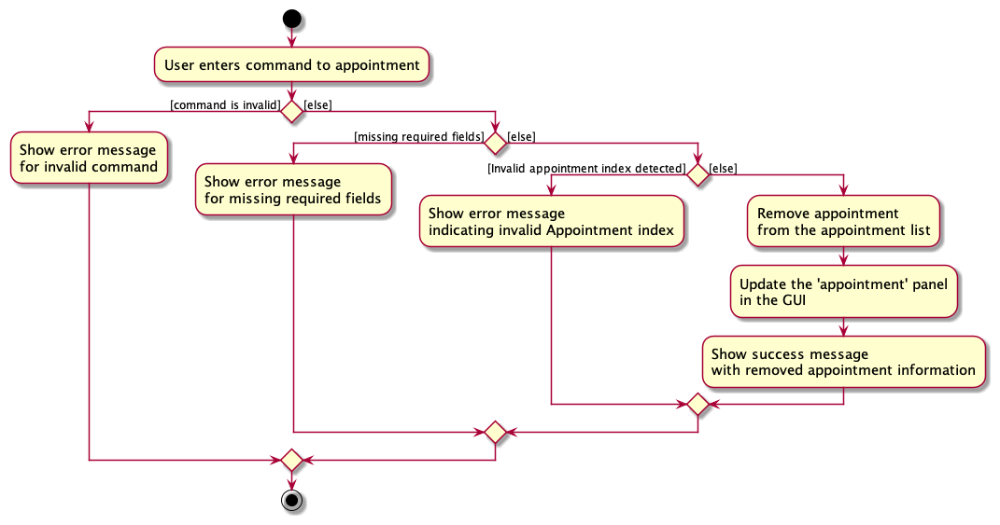

* Step 4. The `parse` command in `deleteAppointmentCommandParser` return an instance of `deleteAppointmentCommand`.
* Step 5. The `LogicManager` calls the `execute` method in `deleteAppointmentCommand`.
* Step 6. The `execute` method in `deleteAppointmentCommand` executes and calls `deleteAppointment` in model to remove appointment from the system.
* Step 7. Success message gets printed onto the results display to notify user.

The sequence diagram below closely describes the interaction between the various components during the execution of the `DeleteAppointmentCommand`.

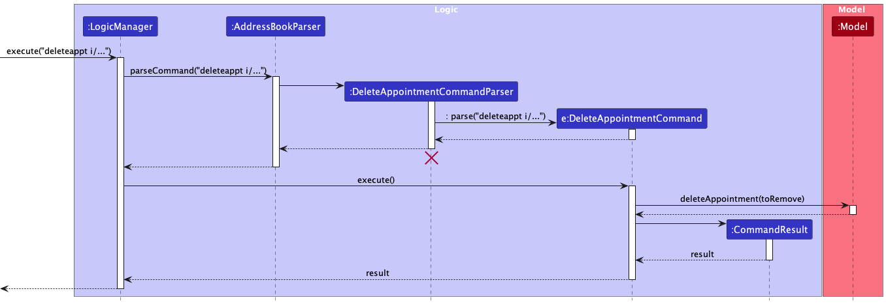

Why is this implemented this way?
1. The `Appointment` class has very similar functionalities to that of the `Person` class, in which both classes deal with deletion operations.
2. Furthermore on the UI, the `Appointment` column runs parallel to the `Person` column, as such, the behaviours (UX) of operating on the `Person` panel should have a similar feel and experience when dealing with `Appointment` objects.
3. This parallelism is also reflected in the backend code, and hence is very similar to how deleting a `Person` is implemented - this is mostly seen through the naming conventions of the classes related to `DeletePerson`, such as `DeleteAppointment`
4. This results in a more familiar experience for both users and developers alike as there is familiarity and some level of consistency when dealing with `Person` and `Appointment` classes.

Alternative implementation for consideration
1. Since both classes exhibit similarities in both code structure and behaviour, we might consider creating a generic class distinguished between `Person` and `Appointment` via enums to handle deletions.
2. This will centralise the behaviours, and reduce the amount of code needed to perform the delete function.
3. A further extension is to do so with all other overlapping functionalities, such as `add` or `edit`, however we leave that possibility for future discussion and refinement.

### Find `Person`
Queries a `Person` entry, either `Doctor` or `Patient` by indicating their name or a substring of their name.
This command is implemented through the `FindCommand` class which extends the `Command` class.

The `find` command is able to take in multiple parameters (at least one), each of these parameters are read as strings, and act as separate queries. This is a feature of the `find` command, to have the capability of parsing both parameters as a short-hand feature.
Example, the command `find hans doe` is equivalent of returning the logical 'or' result of `find hans` and `find doe`.

* Step 1. User enters a `find` command.
* Step 2. The `AddressBookParser` will call `parseCommand` on the user's input string and return an instance of `findCommandParser`.
* Step 3. The `parse` command in `FindCommandParser` checks if at least one parameter is present.
    * If the field is missing, a `ParseException` is thrown, and the UI displays an error message.

The activity diagram below demonstrates this error handling process in more detail.

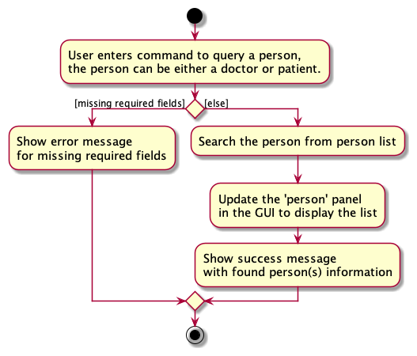

* Step 4. The `parse` command in `FindCommandParser` returns an instance of `FindCommand`.
* Step 5. The `LogicManager` calls the `execute` method in `FindCommand`.
* Step 6. The `execute` method in `FindCommand` executes and calls `updateFilteredPersonList` in model with the `NameContainsKeywordsPredicate` to get a filtered list of person entries of the entered keyword(s), both `patient` and `doctor` entries can be displayed.
* Step 7. A Success message gets printed onto the results display to notify user and the list of matching results is produced.

The sequence diagram below closely describes the interaction between the various components during the execution of the `FindCommand`.

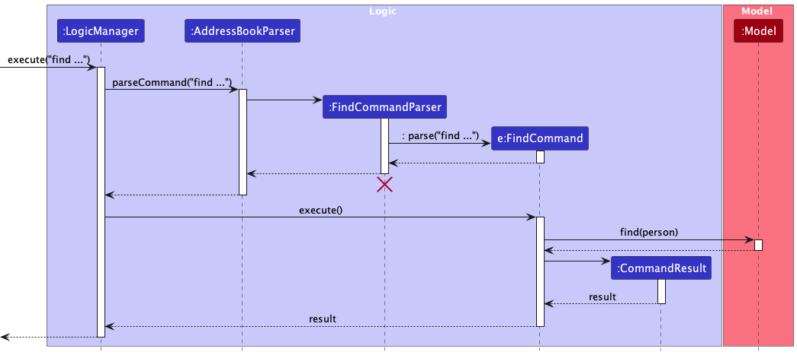

Alternative implementations considered
1. The following sections describes the behaviour of querying `doctor` and `patient` entries by separate commands by all of the entry's fields, both following a very similar logic to how the `find` command is implemented. We might consider using flags to be more precise with our searches, (e.g a -doctor or -patient flag to indicate we wish to search for only `doctor` and `patient` entries respectively) so as to avoid the need to create additional commands. However, we felt that this approach overloaded the `find` method too much, and overcomplicated the `find` command's usage.
2. Even if the `find` command was to be overloaded with flags, we foresaw that the creation of distinct commands to fit the flags parsed by the `find` command was unavoidable. As such, it was prudent to start with the implementation of the distinct commands first (as described in the following sections, each tied to a specific command), and leave the overloading of the `find` command as a later increment.

### Query `doctor`
Queries a `doctor` entry by indicating the exact string, or substring of any of a `doctor`'s fields - name, nric, phone number and date of birth (as displayed on the UI. e.g 30 January 2023).
This command is implemented through the `QueryDoctorCommand` class which extends the `Command` class.

Similar to the `find` command, the `doctor` query command is able to take in multiple parameters (at least one), each of these parameters are read as strings, and act as separate queries, with the result returned being the logical 'or' result of applying a `doctor` query to each parameter separately.

* Step 1. User enters a `doctor` command.
* Step 2. The `AddressBookParser` will call `parseCommand` on the user's input string and return an instance of `QueryDoctorCommandParser`.
* Step 3. The `parse` command in `QueryDoctorCommandParser` checks if at least one parameter is present.
  * If the field is missing, a `ParseException` is thrown, and the UI displays an error message.

The activity diagram below demonstrates this error handling process in more detail.

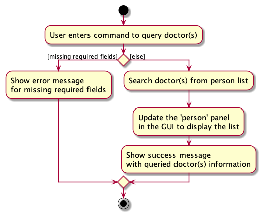

* Step 4. The `parse` command in `QueryDoctorCommandParser` returns an instance of `QueryDoctorCommand`.
* Step 5. The `LogicManager` calls the `execute` method in `QueryDoctorCommand`.
* Step 6. The `execute` method in `QueryDoctorCommand` executes and calls `updateFilteredPersonList` in model with the `DoctorContainsKeywordsPredicate` to get a filtered list of only `Doctor` entries of the entered keywords(s).
* Step 7. Success message gets printed onto the results display to notify user and the list of matching results is produced.

Why is this implemented this way?
1. The backend execution of the `doctor` command and the `find` command are very similar, however the choice to separate the two query commands is justified due to the expansion of fields in the `doctor` query, conceptually making them distinct commands.
2. Furthermore, there is an additional check to check if an entry is of type `doctor` that is not present in the `find` command.

### Query `patient`
Queries a `patient` entry by indicating the exact string, or substring of any of a `patient`'s fields - name, nric, phone number and date of birth (as displayed on the UI. e.g 30 January 2023).
This command is implemented through the `QueryPatientCommand` class which extends the `Command` class.

Similar to the `find` command, the `patient` query command is able to take in multiple parameters (at least one), each of these parameters are read as strings, and act as separate queries, with the result returned being the logical 'or' result of applying a `patient` query to each parameter separately.

* Step 1. User enters a `patient` command.
* Step 2. The `AddressBookParser` will call `parseCommand` on the user's input string and return an instance of `QueryPatientCommandParser`.
* Step 3. The `parse` command in `QueryPatientCommandParser` checks if at least one parameter is present.
  * If the field is missing, a `ParseException` is thrown, and the UI displays an error message.

The activity diagram below demonstrates this error handling process in more detail.

* Step 4. The `parse` command in `QueryPatientCommandParser` returns an instance of `QueryPatientCommand`.
* Step 5. The `LogicManager` calls the `execute` method in `QueryPatientCommand`.
* Step 6. The `execute` method in `QueryPatientCommand` executes and calls `updateFilteredPersonList` in model with the `PatientContainsKeywordsPredicate` to get a filtered list of only `Patient` entries of the entered keywords(s).
* Step 7. Success message gets printed onto the results display to notify user and the list of matching results is produced.

Why is this implemented this way?
1. The backend execution of the `patient` command and the `find` command are very similar, however the choice to separate the two query commands is justified due to the expansion of fields in the `patient` query, conceptually making them distinct commands.
2. Furthermore, there is an additional check to check if an entry is of type `patient` that is not present in the `find` command.

### Query `apptfordoctor`
Queries an `appointment` entry that has the associated `doctor`'s `Nric`, by indicating the exact `Nric` of the doctor as the search parameter.
This command is implemented through the `apptfordoctor` class which extends the `Command` class.

The `apptfordoctor` command takes in multiple parameters (at least one), and each of these parameters are read as strings (not case-sensitive, i.e S1234567A is equivalent to s1234567a), and returns the logical 'or' result of applying the `apptfordoctor` command to each parameter separately. <u>**Note that no errors will not be thrown if the inputted `Nric`(s) are not of the appropriate form** </u>(i.e Begins with one of S, T, G, F, or M, followed by 7 numerical digits, then ended by an alphabetical letter), but rather the expected return result is that no queries will be found.

* Step 1. User enters an `QueryDoctorAppointment` command.
* Step 2. The `AddressBookParser` will call `parseCommand` on the user's input string and return an instance of `QueryDoctorAppointmentCommandParser`.
* Step 3. The `parse` command in `QueryDoctorAppointmentCommandParser` checks if at least one parameter is present.
  * If the field is missing, a `ParseException` is thrown, and the UI displays an error message.

The activity diagram below demonstrates this error handling process in more detail.

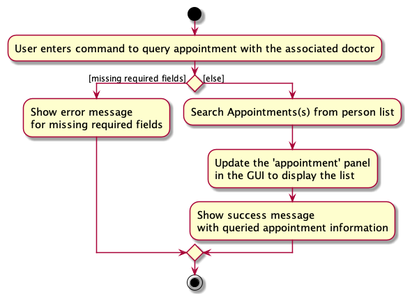

* Step 4. The `parse` command in `QueryDoctorAppointmentCommandParser` returns an instance of `QueryDoctorAppointmentCommand`.
* Step 5. The `LogicManager` calls the `execute` method in `QueryDoctorAppointmentCommand`.
* Step 6. The `execute` method in `QueryDoctorAppointmentCommand` executes and calls `updateFilteredAppointmentList` in model with the `AppointmentContainsDoctorPredicate` to get a filtered list of appointment entries with the entered keyword(s), only those `appointment`(s) that have the associated `doctor`'s `Nric` entries are be displayed.
* Step 7. Success message gets printed onto the results display to notify user and the list of matching results is produced.

Why is this implemented this way?
1. This command closely resembles the `find` command, but can be seen as a stricter version as the results queried do not include substring searches. Therefore, it is justified to separate this command from the `find` command as two distinct commands with distinct `commandParsers`.
2. The rationale behind excluding substring searches for `appointment`(s) is that if a hospital clerk is searching for a specific `doctor`'s scheduled `appointment`(s), the hospital clerk already has the `doctor`'s unique `Nric` and hence including substring querying is irrelevant.

### Query `apptforpatient`

Queries an `appointment` entry that has the associated `patient`'s `Nric`, by indicating the exact `Nric` of the patient as the search parameter.
This command is implemented through the `apptforpatient` class which extends the `Command` class.

The `apptforpatient` command takes in multiple parameters (at least one), and each of these parameters are read as strings (not case-sensitive, i.e S1234567A is equivalent to s1234567a), and returns the logical 'or' result of applying the `apptforpatient` command to each parameter separately. <u>**Note that no errors will not be thrown if the inputted `Nric`(s) are not of the appropriate form** </u>(i.e Begins with one of S, T, G, F, or M, followed by 7 numerical digits, then ended by an alphabetical letter), but rather the expected return result is that no queries will be found.

* Step 1. User enters an `QueryPatientAppointment` command.
* Step 2. The `AddressBookParser` will call `parseCommand` on the user's input string and return an instance of `QueryPatientAppointmentCommandParser`.
* Step 3. The `parse` command in `QueryPatientAppointmentCommandParser` checks if at least one parameter is present.
  * If the field is missing, a `ParseException` is thrown, and the UI displays an error message.

The activity diagram below demonstrates this error handling process in more detail.

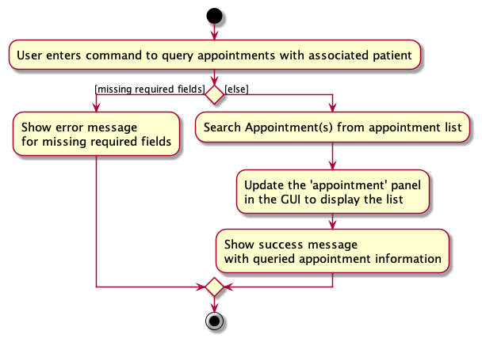

* Step 4. The `parse` command in `QueryPatientAppointmentCommandParser` returns an instance of `QueryPatientAppointmentCommand`.
* Step 5. The `LogicManager` calls the `execute` method in `QueryPatientAppointmentCommand`.
* Step 6. The `execute` method in `QueryPatientAppointmentCommand` executes and calls `updateFilteredAppointmentList` in model with the `AppointmentContainsPatientPredicate` to get a filtered list of appointment entries with the entered keyword(s), only those `appointment`(s) that have the associated `patient`'s `Nric` entries are be displayed.
* Step 7. Success message gets printed onto the results display to notify user and the list of matching results is produced.

Why is this implemented this way?
1. This command closely resembles the `find` command, but can be seen as a stricter version as the results queried do not include substring searches. Therefore, it is justified to separate this command from the `find` command as two distinct commands with distinct `commandParsers`.
2. The rationale behind excluding substring searches for `appointment`(s) is that if a hospital clerk is searching for a specific `patient`'s scheduled `appointment`(s), the hospital clerk already has the `patient`'s unique `Nric` and hence including substring querying is irrelevant.

[//]: # (### \[Proposed\] Undo/redo feature)

[//]: # ()
[//]: # (#### Proposed Implementation)

[//]: # ()
[//]: # (The proposed undo/redo mechanism is facilitated by `VersionedMediCLI`. It extends `MediCLI` with an undo/redo history, stored internally as an `mediCLIStateList` and `currentStatePointer`. Additionally, it implements the following operations:)

[//]: # ()
[//]: # (* `VersionedMediCLI#commit&#40;&#41;` — Saves the current MediCLI state in its history.)

[//]: # (* `VersionedMediCLI#undo&#40;&#41;` — Restores the previous MediCLI state from its history.)

[//]: # (* `VersionedMediCLI#redo&#40;&#41;` — Restores a previously undone MediCLI state from its history.)

[//]: # ()
[//]: # (These operations are exposed in the `Model` interface as `Model#commitMediCLI&#40;&#41;`, `Model#undoMediCLI&#40;&#41;` and `Model#redoMediCLI&#40;&#41;` respectively.)

[//]: # ()
[//]: # (Given below is an example usage scenario and how the undo/redo mechanism behaves at each step.)

[//]: # ()
[//]: # (Step 1. The user launches the  application for the first time. The `VersionedMediCLI` will be initialized with the initial MediCLI state, and the `currentStatePointer` pointing to that single MediCLI state.)

[//]: # ()
[//]: # (![UndoRedoState0]&#40;images/UndoRedoState0.png&#41;)

[//]: # ()
[//]: # (Step 2. The user executes `delete 5` command to delete the 5th person in the MediCLI. The `delete` command calls `Model#commitMediCLI&#40;&#41;`, causing the modified state of the MediCLI after the `delete 5` command executes to be saved in the `mediCLIStateList`, and the `currentStatePointer` is shifted to the newly inserted address book state.)

[//]: # ()
[//]: # (![UndoRedoState1]&#40;images/UndoRedoState1.png&#41;)

[//]: # ()
[//]: # (Step 3. The user executes `addpatient i/S1234567A n/John Doe d/2003-01-30 p/98765432` to add a new person. The `add` command also calls `Model#commitMediCLI&#40;&#41;`, causing another modified MediCLI state to be saved into the `mediCLIStateList`.)

[//]: # ()
[//]: # (![UndoRedoState2]&#40;images/UndoRedoState2.png&#41;)

[//]: # ()
[//]: # (
:information_source: **Note:** If a command fails its execution, it will not call `Model#commitMediCLI&#40;&#41;`, so the MediCLI state will not be saved into the `mediCLIStateList`.)

[//]: # ()
[//]: # (
)

[//]: # ()
[//]: # (Step 4. The user now decides that adding the person was a mistake, and decides to undo that action by executing the `undo` command. The `undo` command will call `Model#undoMediCLI&#40;&#41;`, which will shift the `currentStatePointer` once to the left, pointing it to the previous MediCLI state, and restores the MediCLI to that state.)

[//]: # ()
[//]: # (![UndoRedoState3]&#40;images/UndoRedoState3.png&#41;)

[//]: # ()
[//]: # (
:information_source: **Note:** If the `currentStatePointer` is at index 0, pointing to the initial MediCLI state, then there are no previous MediCLI states to restore. The `undo` command uses `Model#canUndoMediCLI&#40;&#41;` to check if this is the case. If so, it will return an error to the user rather)

[//]: # (than attempting to perform the undo.)

[//]: # ()
[//]: # (
)

[//]: # ()
[//]: # (The following sequence diagram shows how an undo operation goes through the `Logic` component:)

[//]: # ()
[//]: # (![UndoSequenceDiagram]&#40;images/UndoSequenceDiagram-Logic.png&#41;)

[//]: # ()
[//]: # (
:information_source: **Note:** The lifeline for `UndoCommand` should end at the destroy marker &#40;X&#41; but due to a limitation of PlantUML, the lifeline reaches the end of diagram.)

[//]: # ()
[//]: # (
)

[//]: # ()
[//]: # (Similarly, how an undo operation goes through the `Model` component is shown below:)

[//]: # ()
[//]: # (![UndoSequenceDiagram]&#40;images/UndoSequenceDiagram-Model.png&#41;)

[//]: # ()
[//]: # (The `redo` command does the opposite — it calls `Model#redoMediCLI&#40;&#41;`, which shifts the `currentStatePointer` once to the right, pointing to the previously undone state, and restores the MediCLI to that state.)

[//]: # ()
[//]: # (
:information_source: **Note:** If the `currentStatePointer` is at index `mediCLIStateList.size&#40;&#41; - 1`, pointing to the latest MediCLI state, then there are no undone MediCLI states to restore. The `redo` command uses `Model#canRedoMediCLI&#40;&#41;` to check if this is the case. If so, it will return an error to the user rather than attempting to perform the redo.)

[//]: # ()
[//]: # (
)

[//]: # ()
[//]: # (Step 5. The user then decides to execute the command `list`. Commands that do not modify the MediCLI, such as `list`, will usually not call `Model#commitMediCLI&#40;&#41;`, `Model#undoMediCLI&#40;&#41;` or `Model#redoMediCLI&#40;&#41;`. Thus, the `mediCLIStateList` remains unchanged.)

[//]: # ()
[//]: # (![UndoRedoState4]&#40;images/UndoRedoState4.png&#41;)

[//]: # ()
[//]: # (Step 6. The user executes `clear`, which calls `Model#commitMediCLI&#40;&#41;`. Since the `currentStatePointer` is not pointing at the end of the `mediCLIStateList`, all MediCLI states after the `currentStatePointer` will be purged. Reason: It no longer makes sense to redo the `addpatient i/S1234567A n/John Doe d/2003-01-30 p/98765432` command. This is the behavior that most modern desktop applications follow.)

[//]: # ()
[//]: # (![UndoRedoState5]&#40;images/UndoRedoState5.png&#41;)

[//]: # ()
[//]: # (The following activity diagram summarizes what happens when a user executes a new command:)

[//]: # ()
[//]: # ()

[//]: # ()
[//]: # (#### Design considerations:)

[//]: # ()
[//]: # (**Aspect: How undo & redo executes:**)

[//]: # ()
[//]: # (* **Alternative 1 &#40;current choice&#41;:** Saves the entire MediCLI.)

[//]: # (  * Pros: Easy to implement.)

[//]: # (  * Cons: May have performance issues in terms of memory usage.)

[//]: # ()
[//]: # (* **Alternative 2:** Individual command knows how to undo/redo by)

[//]: # (  itself.)

[//]: # (  * Pros: Will use less memory &#40;e.g. for `delete`, just save the person being deleted&#41;.)

[//]: # (  * Cons: We must ensure that the implementation of each individual command are correct.)

[//]: # ()
[//]: # (_{more aspects and alternatives to be added}_)

[//]: # ()
[//]: # (### \[Proposed\] Data archiving)

[//]: # ()
[//]: # (_{Explain here how the data archiving feature will be implemented}_)

## Planned Enhancements

The MediCLI development team acknowledges the presense of known feature flaws in our system.
Thus, we have planned the following 10 enhancements to be added in the near future.
Please find them organised into their respective categories.

### Appointment Functionality Enhancements

1. Adding an end time to appointments

Currently, the MediCLI system only stores the date and start time of an appointment.
However, we recognise that in a fast-paced environment like a hospital, it'd be beneficial to also be able to indicate an end time for appointments.
This is so that the doctor can be safely booked by another patient without worrying about potential clashes in appointment timings.

2. More robust appointment timing validation.

Currently, the MediCLI system allows two appointments with the same doctor/patient and date-time to be simultaneously stored in the system.
However, it is clearly impossible for a patient or doctor to attend two different appointments at the same time.
Thus, we plan to implement a more robust appointment validation system to ensure that appointments with clashing or unrealistic timings can not be entered.

3. Marking old appointments as completed.

Even though the MediCLI system does not allow appointments to be made in the future, it nonetheless retains entry of completed appointments.
However, there is currently no visual distinction between future, completed, and missed appointments. This can be rather confusing for the hospital clerks.
Thus, we plan to add a label (just like the patient/doctor labels) in the top right corner of each appointment card to help better distinguish them.

### Parameter Checking Enhancements

4. Accommodate names with symbols and/or special characters.

The name parameter is currently restricted to just alphabetical characters and white-space.
However, we recognise the existence of names that contain symbols and other special characters.
In the future, we plan to implement a more accommodating constraint that allows UTF-8 characters instead.
This means that names of other languages will be accepted as well.

5. Allow foreign patients/doctors to be added to the system.

The current constraints for the NRIC and phone number parameters reflect the Singaporean format.
However, we recognise that for foreign users, this can be rather limiting.
Thus, in the future, we plan on introducing more refined parameter checking that allows international NRIC and phone number formats.

6. Ensure each person being added to the system is unique.

While the current MediCLI system already checks to ensure every person added is unique, it is only done by comparing the NRIC of the person.
However, this should not be the only checking condition. Two entries with the same name, date of birth, and/or phone number should also be flagged as non-unique.
Thus, we will devise a more holistic assessment criterion to ensure no duplicates are allowed.

### User Interface Enhancements

7. Refine the user interface when the window size is minimised.

The current MediCLI system is not particularly flexible when it comes to window sizing.
Users on smaller screens may encounter the issue of scrolling being disabled or labels being truncated if a long name is entered.
In the future, we plan to make the UI more adaptive and friendly to smaller screens.

8. Standardise displayed information.

For certain fields, the MediCLI system simply displays the text exactly as entered by the user.
However, this can introduce inconsistencies in capitalisation (especially with the NRIC field) when displayed in the user interface.
We plan on standardising these fields by automatically capitalising the users' input.

### Feature Enhancements

9. More advanced search options

Currently, the `find`, `patient`, and `doctor` commands return all entries whose details contain any of the given keywords.
However, this implementation is not particularly effective if the user would like to search for a person that matches all the provided keywords exactly
(e.g. when searching for a person by full name). In the future, we plan to add more advanced search options to allow for easy querying of information.

10. More detailed error messages.

Some of the current error messages are not the most informative
(e.g. If two patient NRICs are provided when creating an appointment, the system only prompts `This appointment is invalid due to invalid inputs.`).
To decrease the learning curve for our system, we plan to replace all ambiguous error messages with more informative versions.

--------------------------------------------------------------------------------------------------------------------

## **Documentation, logging, testing, configuration, dev-ops**

* [Documentation guide](Documentation.md)
* [Testing guide](Testing.md)
* [Logging guide](Logging.md)
* [Configuration guide](Configuration.md)
* [DevOps guide](DevOps.md)

--------------------------------------------------------------------------------------------------------------------

## **Appendix: Requirements**

### Product scope

**Target user profile**:

* hospital clerks who deal with hospital related registration/administrative/management tasks
* has a need to manage a significant number of client details (patients/doctors/appointments)
* deals with many real time live updates, some being time-critical
* prefer desktop apps over other types
* can type fast and accurately
* prefers typing to mouse interactions
* is reasonably comfortable using CLI apps

**Value proposition**: manages the hospital database (querying/updating/creating/deleting) faster than a typical mouse/GUI driven database management app

### User stories

Priorities: High (must have) - `* * *`, Medium (nice to have) - `* *`, Low (unlikely to have) - `*`

| Priority  | As a …​                                    | I want to …​                               | So that I can…​                                                   |
|-----------|--------------------------------------------|--------------------------------------------|-------------------------------------------------------------------|
| `* * *`   | hospital clerk                             | add patients                               | handle incoming patients when handling emergency call-ins         |
| `* * *`   | hospital clerk                             | delete patients                            | remove old patients to prevent clogging of system                 |
| `* * *`   | hospital clerk                             | add doctors                                | register new doctors as they get hired                            |
| `* * *`   | hospital clerk                             | delete doctors                             | remove previous doctors that have left the hospital               |
| `* * *`   | hospital clerk                             | create appointments                        | arrange a meeting time between a doctor and a patient             |
| `* * *`   | hospital clerk                             | delete appointments                        | remove a meeting time if either party becomes unavailable         |
| `* * *`   | hospital clerk                             | query patient by name                      | retrieve their relevant information                               |
| `* * *`   | hospital clerk                             | query doctor by name                       | retrieve their relevant information                               |
| `* *`     | hospital clerk                             | query appointment by patient               | look up what appointments a patient has to attend                 |
| `* *`     | hospital clerk                             | query appointment by doctor                | look up what appointments a doctor has to service                 |
| `*`       | hospital clerk                             | query patient by other fields              | retrieve patient information through other fields if they call-in |
| `*`       | hospital clerk                             | find available timings to book appointment | schedule a time that suits both the patient and doctor            |

### Use cases

(For all use cases below, the **System** is the `mediCLI` and the **Actor** is the `hospital clerk`, unless specified otherwise)

**Use case: Add a patient**

**MSS**

1.  Hospital clerk enters patient data
2.  mediCLI adds the patient into database

Use case ends.

**Extensions**

* 1a. The entered patient data is not in the correct format
  * *1a1. mediCLI shows an error message

Use case ends.

**Use case: Delete a patient**

**MSS**

1.  Hospital clerk requests to list persons
2.  mediCLI shows a list of persons
3.  Hospital clerk requests to delete a specific patient in the list
4.  mediCLI deletes the patient

Use case ends.

**Extensions**

* 2a. The list is empty.

    Use case ends.

* 3a. The given index is invalid.
  * 3a1. mediCLI shows an error message.

    Use case ends.

**Use case: Create an appointment**

**MSS**

1.  Hospital clerk needs to create appointment between doctor and patient
2.  Hospital clerk enters doctor and patient details
3.  mediCLI creates the appointment

Use case ends.

**Use case: Delete an appointment**

**MSS**

1.  Hospital clerk needs to delete appointment between doctor and patient
2.  Hospital clerk enters appointment id
3.  mediCLI deletes the appointment

Use case ends.

**Use case: Query patient by name**

**MSS**

1.  Hospital clerk needs to search for patient
2.  Hospital clerk enters patient name
3.  mediCLI lists patients with supplied name

Use case ends.

**Extensions**

* 3a. The list is empty

  Use case ends.

**Use case: Query appointments by patient**

**MSS**

1.  Hospital clerk needs to search for appointment by patient
2.  Hospital clerk enters patient name
3.  mediCLI lists relevant appointments

Use case ends.

**Extensions**

* 3a. The list is empty

  Use case ends.

**Use case: Query appointments by doctor**

**MSS**

1.  Hospital clerk needs to search for appointment by doctor
2.  Hospital clerk enters doctor name
3.  mediCLI lists relevant appointments

Use case ends.

**Extensions**

* 3a. The list is empty

Use case ends.

### Non-Functional Requirements

1.  Should work on any _mainstream OS_ as long as it has Java `11` or above installed.
2.  Should be able to hold up to 1000 medical staff without a noticeable sluggishness in performance for typical usage.
3.  A user with above average typing speed for regular English text (i.e. not code, not system admin commands) should be able to accomplish most of the tasks faster using commands than using the mouse.
4.  mediCLI should be easy to integrate with existing medical database systems so that staff can immediately switch to the new app.
5.  Comprehensive documentation should be provided, including user guides, command references, and troubleshooting resources.

### Glossary

* **Private contact detail**: A contact detail that is not meant to be shared with others.
* **CLI**: Command Line Interface, a way of interacting with a computer program where the user enters commands into a terminal or command prompt.
* **GUI**: Graphical User Interface, a way of interacting with a computer program using graphical elements such as windows, buttons, and menus.
* **JSON**: JSON: JavaScript Object Notation, a lightweight data interchange format used to store and exchange data.
* **API**: Application Programming Interface, a set of rules and protocols for building and interacting with software applications.
* **UI**: User Interface, the visual part of a computer program that allows users to interact with it.
* **XML**: Extensible Markup Language, a markup language that defines rules for encoding documents in a format that is both human-readable and machine-readable.
* **MSS**: Main Success Scenario, the primary flow of events in a use case that leads to the desired outcome.

--------------------------------------------------------------------------------------------------------------------

## **Appendix: Instructions for manual testing**

Given below are instructions to test the app manually.

:information_source: **Note:** These instructions only provide a starting point for testers to work on;
testers are expected to do more *exploratory* testing.

### Launch and shutdown

1. Initial launch

   1. Download the jar file and copy into an empty folder

   1. Double-click the jar file Expected: Shows the GUI with a set of sample contacts. The window size may not be optimum.

1. Saving window preferences

   1. Resize the window to an optimum size. Move the window to a different location. Close the window.

   1. Re-launch the app by double-clicking the jar file. 
       Expected: The most recent window size and location is retained.

1. _{ more test cases …​ }_

### Deleting a person

1. Deleting a person while all persons are being shown

   1. Prerequisites: List all persons using the `list` command. Multiple persons in the list.

   1. Test case: `delete 1` 
      Expected: First contact is deleted from the list. Details of the deleted contact shown in the status message. Timestamp in the status bar is updated.

   1. Test case: `delete 0` 
      Expected: No person is deleted. Error details shown in the status message. Status bar remains the same.

   1. Other incorrect delete commands to try: `delete`, `delete x`, `...` (where x is larger than the list size) 
      Expected: Similar to previous.

1. _{ more test cases …​ }_

### Saving data

1. Dealing with missing/corrupted data files

   1. _{explain how to simulate a missing/corrupted file, and the expected behavior}_

1. _{ more test cases …​ }_
