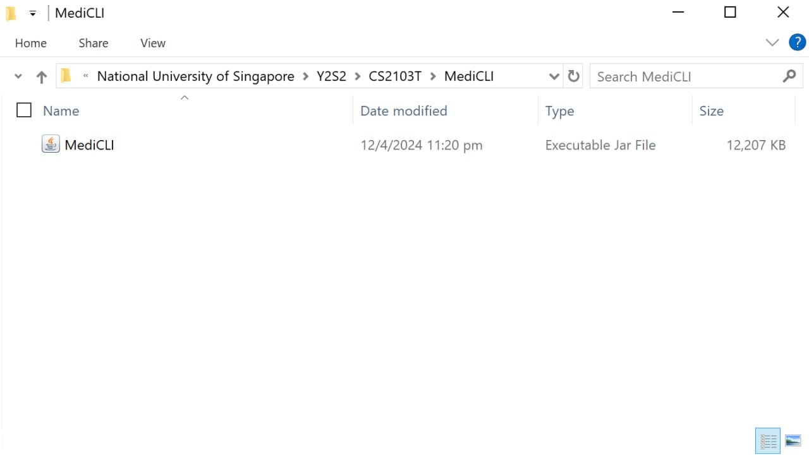
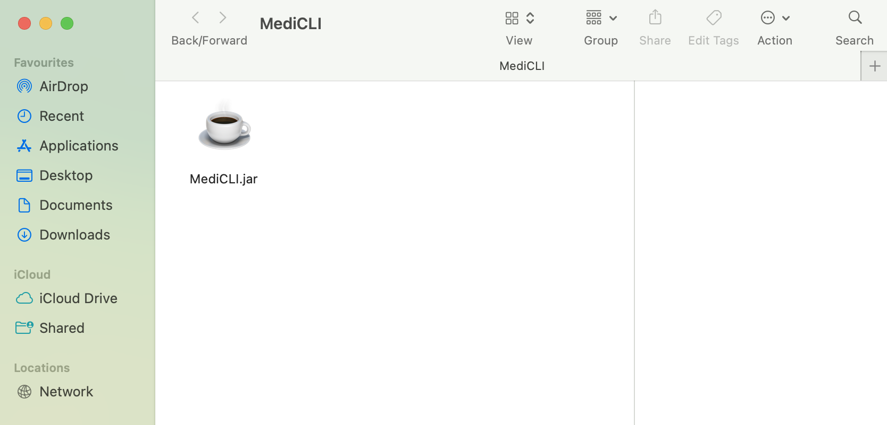
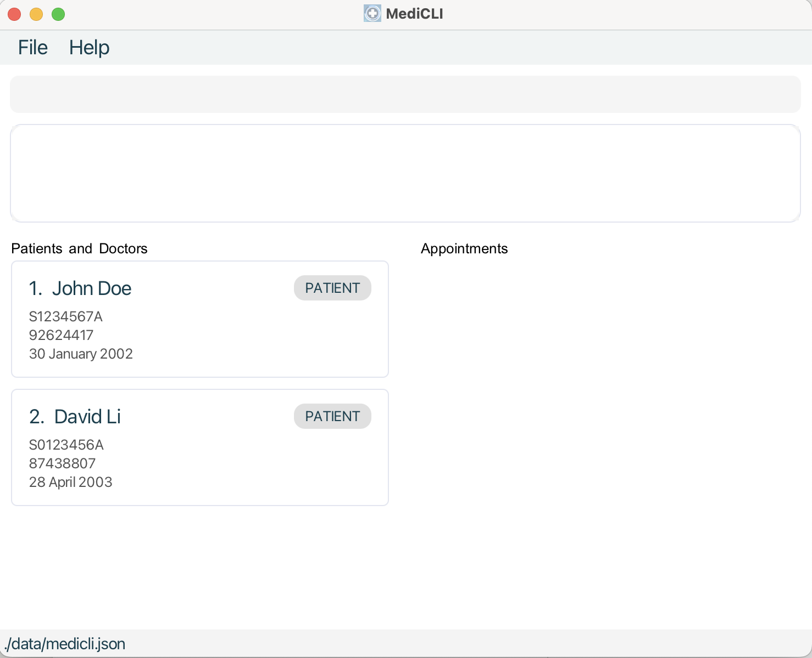
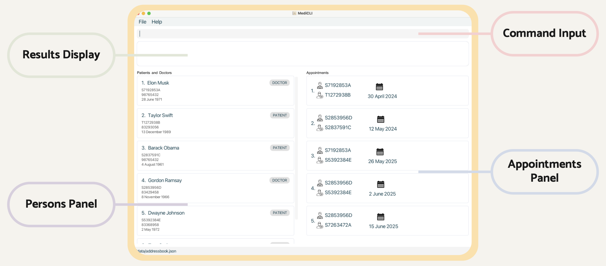
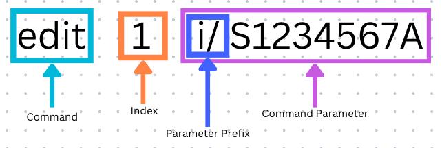
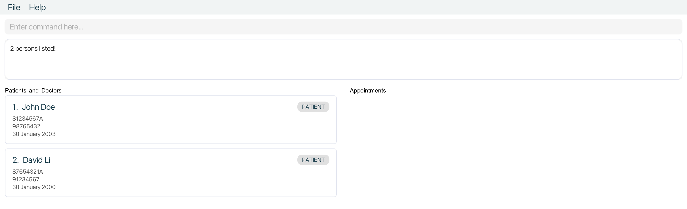
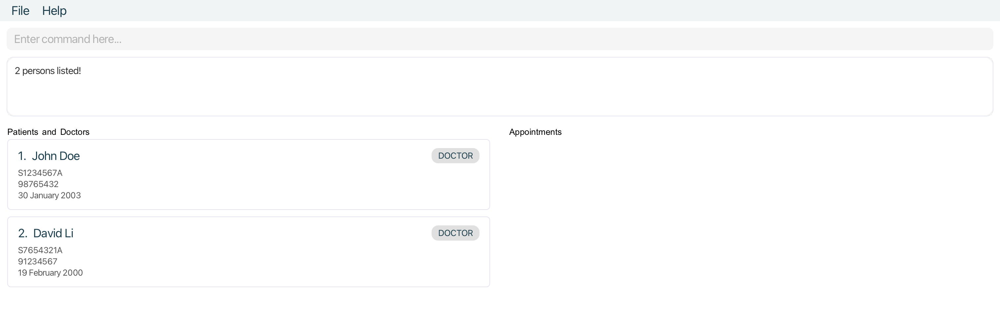
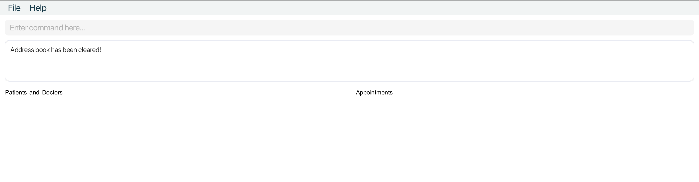

## Welcome to MediCLI!
[Welcome note]
MediCLI is a **desktop app for managing persons involved in a hospital, optimised for use via a Command Line Interface** (CLI) while still having the benefits of a Graphical User Interface (GUI). Targeted at fast typing hospital clerks, MediCLI allows them to manage doctors, patients and appointments faster than traditional GUI apps.

## Who can benefit from MediCLI?
[Target audience]

* Table of Contents
{:toc}

---------------------------------------------------------
## Purpose of UG

## How to use this UG
As you read through this MediCLI User Guide, you will come across a variety of different types of text formats. The table below will explain to you what they mean.

| Text Format        | What it means                                                                                          |
|--------------------|--------------------------------------------------------------------------------------------------------|
| [hyperlink]()      | Text in blue are hyperlinks and will take you to a different page.                                     |
| `command`          | Text in lowercase with grey background box are MediCLI commands.                                       |
| `FIELD`            | Text in uppercase with grey background box are inputs to MediCLI commands                              |
| `[OPTIONAL_FIELD]` | Text in uppercase with grey background box and square brackets are optional inputs to MediCLI commands |

Take note of these text-boxes, as they give you important information for using MediCLI.

:bulb: **TIP**: Tip call-outs give you helpful pointers in MediCLI!

:information_source: **INFO**: Info call-outs give you information about MediCLI that you can take note of!

:exclamation: **DANGER**: Danger call-outs like this contain dangerous actions you should remember when using MediCLI to avoid errors!

--------------------------------------------------------------------------------------------------------------------
## Key Product Information
[provides a user-centric statement detailing
product information, including product
description and an overview of main
features.]

## Quick start Guide

Ready to step into the world of MediCLI? This section will provide detailed information on how users can get started,
which includes basic system requirements, installation instructions, overview of the main window,
and a tutorial on using the command-line interface (CLI).

### System Compatibility

MediCLI is written with the Java programming language on the backend and JavaFX on the front end.
Therefore, a device with <b>Java version 11 or above and JavaFX version 17 or above</b> installed is required to run MediCLI.

Compatible Operating Systems:
* Any device running Windows, macOS, or Ubuntu with sufficient Java and JavaFX compatibility.

Recommended Minimum System Requirements:
* 2-core CPU running at 2.40 GHz
* 4GB RAM
* 2GB free disc space

### Installation Instructions

1. Please make sure the computer you are using meets the system compatibility specified above.

1. Download the latest `MediCLI.jar` from [here](https://github.com/AY2324S2-CS2103T-T15-1/tp/releases).

:information_source: **INFO**: The MediCLI jar file can be found at the bottom of the release notes

1. We recommend you to copy the file into the folder you want to use as the _home folder_ for MediCLI. This is because running the application will create additional storage and logging files.

1. Congratulations! You now have MediCLI successfully downloaded on your computer.

### Starting up MediCLI

Once you have installed MediCLI onto your computer (refer to the sub-section above), navigate to the instruction specific to your operating system below.

#### Windows

1. Open file explorer and navigate to the home folder containing the MediCLI jar file.

2. Double-click on the MediCLI application and it should start up! 

    

#### macOS

1. Open finder and navigate to the home folder containing the MediCLI jar file.

2. Double-click on the MediCLI application and it should start up! 

    

#### CLI Alternative Solution

1. Open a command terminal, `cd` into the home folder containing the MediCLI jar file, and use the `java -jar MediCLI.jar` command to run the application. 
   A GUI similar to the below should appear in a few seconds. Note how the app contains some sample data. 

   

### Overview of MediCLI Main Window

MediCLI has 4 primary components in its main window. Detailed descriptions of each can be found below.

<b>Command Input</b> - This is where you will type your commands.

<b>Results Display</b> - MediCLI will respond to you here with either a success message or a detailed description of what went wrong.

<b>Persons Panel</b> - This is where you will see a list of the filtered patients and patients.

<b>Appointments Panel</b> - This is where you will see a list of the filtered patients and patients.

### How to use the command line interface (CLI)

MediCLI is operated using typed commands to the command line interface (CLI). Do not worry if you do not understand CLI yet; Here we will explain to you the formats of text commands and how to use them.

| CLI Format        | What it means                                                                                                                                                                                                                                                        |
|-------------------|----------------------------------------------------------------------------------------------------------------------------------------------------------------------------------------------------------------------------------------------------------------------|
| Command           | The command tells MediCLI what action you want to perform.                                                                                                                                                                                                           |
| Index             | Certain MediCLI commands have an `INDEX` field, which is a number that is assigned to a particular patient, doctor or appointment. Index must be larger than 1 and can be up to the maximum number of patients/doctors or appointments as listed in the MediCLI GUI. |
| Parameter Prefix  | Fields typically have a prefix like `i/` or `n/` followed by the field content. This tells MediCLI what field you are entering.                                                                                                                                      |
| Command Parameter | The command parameter is the parameter prefix followed by field content. For example, the command parameter to enter NRIC would be `i/S1234567A`                                                                                                                     |

:information_source: **INFO**: Not all MediCLI commands have fields! For example, the command to clear all data is simply `clear`.

### Quick Tutorial on a Sample Use Case

1. Type the command in the command box and press Enter to execute it. e.g. typing **`help`** and pressing Enter will open the help window. 

    Some example commands you can try (Assuming MediCLI is opened for the first time and is in its initial state with the default sample data):

   * `list` : Lists all contacts.

   * `adddoctor i/S1234567B n/Amy Smith d/2003-01-30 p/98765432` : Adds a doctor named `Amy Smith` to the MediCLI system.

   * `addappt ad/2024-06-09 10:15 dn/S1234567B pn/S1234567A` : Schedules an appointment between the doctor `Amy Smith` and the patient `John Doe`.

   * `delete 2` : Deletes the 2nd person currently listed in the MediCLI system (patient named David Li).

   * `exit` : Exits the app.

1. Refer to the [Features](#features) below for details of each command.

## Features

**:information_source: Notes about the command format:** 

* Words in `UPPER_CASE` are the parameters to be supplied by you. 
  e.g. in `addpatient i/NRIC n/NAME d/DOB p/PHONE`, `NAME` is a parameter which can be used as `n/John Doe`.

* Items in square brackets are optional. 
  e.g `edit INDEX [i/NRIC] [n/NAME] [p/PHONE] [d/DOB]` can be used as `edit 1 n/John Doe` or as `edit 1 i/t1234567s`.

* Parameters can be in any order. 
  e.g. if the command specifies `n/NAME p/PHONE`, `p/PHONE n/NAME` is also acceptable.

* Extraneous parameters for commands that do not take in parameters (such as `help`, `list`, `exit` and `clear`) will be ignored. 
  e.g. if the command specifies `help 123`, it will be interpreted as `help`.

* If you are using a PDF version of this document, be careful when copying and pasting commands that span multiple lines as space characters surrounding line-breaks may be omitted when copied over to the application.

### Viewing help : `help`

Shows a message explaining how to access the help page.

Format: `help`

### Listing all persons : `list`

Shows a list of all persons (patients & doctors) and appointments in the MediCLI system.

Format: `list`

### Adding a patient: `addpatient`

Adds a patient into the MediCLI system.

Format: `addpatient i/NRIC n/NAME d/DOB p/PHONE`

Field Constraints:
* **NRIC** : Follows the correct Singapore NRIC format. Begin with one of S, T, G, F, or M, followed by 7 numerical digits, then ended by an alphabetical letter. This field is non-case-sensitive.
* **NAME** : Only contain alphabetical characters and spaces. This field is non-case-sensitive.
* **DOB** : Only contain numerical characters in the format yyyy-mm-dd. Acceptable date range is from 1900 Janurary 1st to today's date.
* **PHONE** : Only contain numerical characters and of exactly 8 digits long.

Command Constraints:
* All of the above fields (NRIC, NAME, DOB, and PHONE) are compulsory and must be non-empty.
* Command fails if there already exists a person (patient or doctor) in the MediCLI system that has the same NRIC as the one given.
* The ordering of the fields does not influence the command.

Examples:
* `addpatient i/T0334567A n/John Doe d/2003-01-30 p/98765432`
* `addpatient n/Amy Smith i/S8054321B p/87654321 d/1980-12-05`

### Adding a Doctor : `adddoctor`                                                                                                                                                                    
                                                                                                                                                                                                    
Adds a doctor into the MediCLI system.                                                                                                                                                              
                                                                                                                                                                                                    
Format: `adddoctor i/NRIC n/NAME d/DOB p/PHONE`                                                                                                                                                     
                                                                                                                                                                                                    
Field Constraints:                                                                                                                                                                                  
* **NRIC** : Follows the correct Singapore NRIC format. Begin with one of S, T, G, F, or M, followed by 7 numerical digits, then ended by an alphabetical letter. This field is non-case-sensitive. 
* **NAME** : Only contain alphabetical characters and spaces. This field is non-case-sensitive.                                                                                                     
* **DOB** : Only contain numerical characters in the format yyyy-mm-dd. Acceptable date range is from 1900 Janurary 1st to today's date.                                                            
* **PHONE** : Only contain numerical characters and of exactly 8 digits long.                                                                                                                       
                                                                                                                                                                                                    
Command Constraints:                                                                                                                                                                                
* All of the above fields (NRIC, NAME, DOB, and PHONE) are compulsory and must be non-empty.                                                                                                        
* Command fails if there already exists a person (patient or doctor) in the MediCLI system that has the same NRIC as the one given.                                                                 
* The ordering of the fields does not influence the command.                                                                                                                                        
                                                                                                                                                                                                    
Examples:                                                                                                                                                                                           
* `adddoctor i/T0334567A n/John Doe d/2003-01-30 p/98765432`                                                                                                                                        
* `adddoctor n/Amy Smith i/S8054321B p/87654321 d/1980-12-05`                                                                                                                                       

### Adding an appointment : `addappt`

Adds an appointment to MediCLI. Appointments are between a doctor with the specified `DOCTOR_NRIC` and a patient with the `PATIENT_NRIC` on a specific date and time.
Note that while you cannot create a new appointment with the date and time in the past, appointments that were valid when created but are now past their date and time will be allowed to remain in the system. This is an intended feature to allow the hospital admins to track a patient/doctors past appointments.
Format: `addappt ad/DATETIME dn/DOCTOR_NRIC pn/PATIENT_NRIC`

Field Constraints:
- **DATETIME**: Input must be in the format `yyyy-MM-dd HH:MM`. Specified date and time must be later than the current date and time. i.e. appointment cannot be scheduled in the past.
- **DOCTOR_NRIC**: Follows the correct Singapore NRIC format. Begin with one of S, T, G, F, or M, followed by 7 numerical digits, then ended by an alphabetical letter. This field is non-case-sensitive.
- **PATIENT_NRIC**: Follows the correct Singapore NRIC format. Begin with one of S, T, G, F, or M, followed by 7 numerical digits, then ended by an alphabetical letter. This field is non-case-sensitive.

Command Constraints:
- All of the above fields (`DATETIME`, `DOCTOR_NRIC`, `PATIENT_NRIC`) are compulsory and must be non-empty.
- A doctor with the specified `DOCTOR_NRIC` must already exist in the MediCLI System.
- A patient with the specified `PATIENT_NRIC` must already exist in the MediCLI System.

Examples:
- `addappt ad/2024-08-11 23:50 dn/S1234567A pn/S1234567B`
- `addappt ad/2025-04-09 11:10 dn/S8054321B pn/T0334567A`
                  

### Editing a person : `edit`

Edits an existing person in the MediCLI system.

Format: `edit INDEX [i/NRIC] [n/NAME] [p/PHONE] [d/DOB]`

* Edits the patient or doctor at the specified `INDEX`. The index refers to the index number shown in the displayed person list. The index **must be a positive integer** 1, 2, 3, …​
* At least one of the optional fields must be provided.
* Existing values will be updated to the input values.
* Note that editing a patient or doctor and not changing any of the values of the parameters is allowed and is considered a valid edit by the system.
* Note that editing a patient or doctor will recursively update the relevant details of all appointments related to the patient or doctor.

Field Constraints:
* **NRIC** : Follows the correct Singapore NRIC format. Begin with one of S, T, G, F, or M, followed by 7 numerical digits, then ended by an alphabetical letter. This field is non-case-sensitive.
* **NAME** : Only contain alphabetical characters and spaces. This field is non-case-sensitive.
* **DOB** : Only contain numerical characters in the format yyyy-mm-dd. Acceptable date range is from 1900 Janurary 1st to today's date.
* **PHONE** : Only contain numerical characters and of exactly 8 digits long.

Command Constraints:
* Command fails if there already exists a person (patient or doctor) in the MediCLI system that has the same NRIC as the one given.
* The ordering of the fields does not influence the command.

Examples:
*  `edit 1 i/S1234567A n/Betsy Crower` Edits the NRIC and name of the 1st person to be `s1234567a` and `Betsy Crower` respectively.
                                  

### Editing an appointment : `editappt`
Edits an existing appointment in the MediCLI system.                                                                                                                                                               
                                                                                                                                                                                
Format: `editappt INDEX ad/DATETIME`                                                                                                                        
                                                                                                                                                                                
* Edits the appointment at the specified `INDEX`. The index refers to the index number shown in the displayed appointment list. The index **must be a positive integer** 1, 2, 3, …​      
* Existing values will be updated to the input values.                                                                                                                          

Field Constraints:
* **DATETIME** : Input must be in the format `yyyy-MM-dd HH:MM`. Specified date and time must be later than the current date and time. i.e. appointment cannot be scheduled in the past.

Examples:    

*  `editappt 1 ad/2025-04-09 11:00` Edits the appointment date and time of the first appointment in the appointment list to `2025-04-09 11:00`                                   

### Finding both doctor and patient by name: `find`

Finds `Patient`(s) or `Doctor`(s) whose details contain any of the given keywords.

Format for querying patients or doctors: `find KEYWORD [MORE_KEYWORDS]`

Command Constraints:

* The search is case-insensitive. e.g `hans` will match `Hans`
* The order of the keywords does not matter. e.g. `Hans Bo` will match `Bo Hans`
* Only the name field is searched.
* Both full words and substrings will be matched e.g. `Han` will match `Hans`
* Patients and Doctors matching at least one keyword will be returned (i.e. logical 'OR' search).
  e.g. `Hans Bo` will return `Hans Gruber`, `Bo Yang`

Examples:
* `find John` returns `john` and `John Doe`
* `find alex david` returns `Alex Yeoh`, `David Li` 

### Querying persons by name: `patient`

Finds `Patient`(s) whose details contain any of the given keywords.

Format for querying Patients: `patient KEYWORD [MORE_KEYWORDS]`

Command Constraints:

* The search is case-insensitive. e.g `hans` will match `Hans`
* The order of the keywords does not matter. e.g. `Hans Bo` will match `Bo Hans`
* All person fields are searched and matched (Name, NRIC, Phone Number, DoB).
* Both full words and substrings will be matched e.g. `Han` will match `Hans`
* Patients matching at least one keyword will be returned (i.e. `OR` search).
  e.g. `Hans Bo` will return `Hans Gruber`, `Bo Yang`

Examples:
* `patient John David` returns `patient` with name `John Doe` and `patient` with name `David Li`
* `patient S1234` returns `patient` with `Nric` `S1234567A`, `patient` with `Nric` `S1234765Q`
* `patient 30 Jan` returns `patient` with `DoB` `30 January 1990`, `patient` with `DoB` `30 January 2001` 
  
                                   

### Querying persons by name : `doctor`                                     
                                                                                   
Finds `Doctors`(s) whose details contain any of the given keywords.               
                                                                                  
Format for querying Doctors: `doctor KEYWORD [MORE_KEYWORDS]`                     
                  
Command Constraints:
                                                                 
* The search is case-insensitive. e.g `hans` will match `Hans`                    
* The order of the keywords does not matter. e.g. `Hans Bo` will match `Bo Hans`  
* All person fields are searched and matched (Name, NRIC, Phone Number, DoB).     
* Both full words and substrings will be matched e.g. `Han` will match `Hans`     
* Doctors matching at least one keyword will be returned (i.e. logical 'or' search).      
  e.g. `Hans Bo` will return `Hans Gruber`, `Bo Yang`                             
                                                                                  
Examples:                                                                         
* `doctor John David` returns `doctor` with name `John Doe` and `doctor` with name `David Li`
* `doctor S1234` returns `doctor` with `Nric` `S1234567A`, `doctor` with `Nric` `S1234765Q`
* `doctor 30 Jan` returns `doctor` with `DoB` `30 January 1990`, `doctor` with `DoB` `30 January 2001`               
             
                                 

### Querying appointments by Patient's NRIC : `apptforpatient`                                                             
                                                                                                                                 
Format: `apptforpatient KEYWORD [MORE_KEYWORDS]`                                    
                                                       
Command Constraints:                                                                          
* The search is case-insensitive. e.g `s1234562a` will match `S1234562A`                                                        
* The order of the keywords does not matter. e.g. `S1234562A S1234561A` will                                                    
match appointments that involve `S1234562A` and `S1234561A`.                                                                  
* Only the NRIC field of `Patient` is searched and matched.                                                       
* Only exact NRICs will be matched e.g. `S123456` will not match `S1234562A`                                                    
* Appointments with `Patient`s whose NRICs match at least one keyword will be returned (i.e. `OR` search).         

Example:                                                                                                                
* `apptforpatient s0123456a` returns all `Appointment` entries that `Patient` with `Nric` `S0123456A` is involved in.   
                                                                                                                        
* All `Appointment`s listed                                                                        
                                      
                                                                                                                        
* Only `Appointment`s with `Patient` of `Nric` `S0123456A`                                           
                                       
            

### Querying appointments by Doctor's NRIC : `apptfordoctor`                                                                       
                                                                                                                        
Format: `apptfordoctor KEYWORD [MORE_KEYWORDS]`                                                                         
                                                                                                                        
Command Constraints:                                                                                                    
                                                                                                                        
* The search is case-insensitive. e.g `s1234562a` will match `S1234562A`                                                
* The order of the keywords does not matter. e.g. `S1234562A S1234561A` will                                            
match appointments that involve `S1234562A` and `S1234561A`.                                                            
  * Only the NRIC field of `Doctor` is searched and matched.                                                            
* Only exact NRICs will be matched e.g. `S123456` will not match `S1234562A`                                            
* Appointments with `Doctor`s whose NRICs match at least one keyword will be returned (i.e. `OR` search).               
                                                                                                                        
Example:                                                                                                                
* `apptfordoctor s1234561a` returns all `Appointment` object(s) that `Doctor` with NRIC `S1234561A` is involved in.     
                                                                                                                        
* All `Appointment`s listed                                                  
                                       
                                                                                                                        
* Only `Appointment`s with `Doctor` of `Nric` `S1234561A`                                               
                                        
                                                                                                                        

### Deleting a doctor or patient : `delete`

Deletes the specified doctor / patient from the MediCLI system. <u>**Note that all associated appointments with this doctor / patient will also be recursively deleted.**</u> Please exercise caution when using the delete command and removing a patient or a doctor from MediCLI, as this action cannot be undone.

* Deletes the doctor / patient at the specified `INDEX`.
* The index refers to the index number shown in the displayed doctor and patient list.
* The index **must be a positive integer** 1, 2, 3, …​

Examples:
* `list` followed by `delete 2` deletes the 2nd doctor / patient in the mediCLI system.
* `patient John` followed by `delete 1` deletes the 1st patient in the results of the `patient` search command.
* `doctor Steve` followed by `delete 2` deletes the 2nd doctor in the results of the `doctor` search command.

### Deleting appointment : `deleteappt`

Deletes the specified appointment from the MediCLI system.

Format: `deleteappt INDEX`

* Deletes the appointment at the specified `INDEX`.
* The index refers to the index number shown in the displayed appointments list.
* The index **must be a positive integer** 1, 2, 3, …​

Examples:
* `list` followed by `deleteappt 2` deletes the 2nd appointment in the mediCLI system.
* `apptforpatient S1234567A` followed by `deleteappt 1` deletes the 1st appointment in the results of the `apptforpatient` search command.
* `apptfordoctor S1234567B` followed by `deleteappt 2` deletes the 2nd appointment in the results of the `apptfordoctor` search command.

Visual Guide
* All appointments listed after running `list`                                                                   
  
* After running `deleteappt` with `Index` of `1`                                                            
  

### Clearing all entries : `clear`                                                                  
                                                                                                 
Clears all entries from MediCLI.

Warning!!! This will wipe the entire data from the system upon being executed. Please be very purposeful and cautious when you use this.
                                                                                                 
Format: `clear`                                                                                     

### Exiting the program : `exit`

Exits the program.

Format: `exit`

### Saving the data

MediCLI data are saved in the hard disk automatically after any command that changes the data. There is no need to save manually.

### Editing the data file

MediCLI data are saved automatically as a JSON file `[JAR file location]/data/medicli.json`. Advanced users are welcome to update data directly by editing that data file.

:exclamation: **Caution:**
If your changes to the data file makes its format invalid, mediCLI will discard all data and start with an empty data file at the next run. Hence, it is recommended to take a backup of the file before editing it. 
Furthermore, certain edits can cause the mediCLI to behave in unexpected ways (e.g., if a value entered is outside of the acceptable range). Therefore, edit the data file only if you are confident that you can update it correctly.

--------------------------------------------------------------------------------------------------------------------

## FAQ

**Q**: How do I transfer my data to another Computer? 
**A**: Install the app in the other computer and overwrite the empty data file it creates with the file that contains the data of your previous MediCLI home folder.

**Q**: Can I use MediCLI on different operating systems? 
**A**: Yes, MediCLI is compatible with multiple operating systems as long as you have Java 11 or above installed. You can run it on Windows, macOS, or Linux.

**Q**: Is there a limit to the number of patients, doctors, or appointments I can add to MediCLI? 
**A**: There is no built-in limit to the number of entries you can add to MediCLI. However, the performance may be affected if you add an extremely large number of entries.

**Q**: Can I customize the appearance or theme of the interface in MediCLI? 
**A**: Currently, there is no option to customize the appearance or theme of the interface in MediCLI. It has a default interface optimized for efficiency and usability.

**Q**: Does MediCLI support multi-user access or user authentication? 
**A**: No, MediCLI is designed for single-user access only. It does not have built-in support for multi-user access or user authentication.

**Q**: Can I export data from MediCLI to other formats like CSV or Excel? 
**A**: Currently, there is no built-in feature to export data from MediCLI to other formats. However, you can manually extract data from the JSON file if needed.

--------------------------------------------------------------------------------------------------------------------

## Known issues

1. **Issue**: When using multiple screens, if the MediCLI application is moved to a secondary screen and later switched to using only the primary screen, the graphical user interface (GUI) may open off-screen upon application launch.

   **Impact**: Users may find it challenging to interact with the application as the GUI is rendered off-screen, making it inaccessible and difficult to use.

   **Workaround**: To resolve this issue, users can delete the preferences.json file generated by the application before launching MediCLI again. This action resets the application preferences, ensuring that the GUI opens within the visible area of the primary screen.
2. **Issue**: MediCLI may experience performance degradation when handling a large number of entries, such as patients, doctors, or appointments.

   **Impact**: Users may notice slower response times or delays when adding, editing, or deleting entries, especially in cases with a large dataset.
   
   **Workaround**: Users can optimize performance by limiting the number of entries stored in MediCLI or by periodically archiving old data to reduce the dataset size.
3. **Issue**: Editing data directly in the data file may lead to unexpected behavior or data corruption.

   **Impact**: Users who manually edit the JSON data file used by MediCLI may inadvertently introduce errors or inconsistencies, resulting in data loss or application crashes.

   **Workaround**: It's recommended to avoid directly editing the data file unless absolutely necessary. Users should exercise caution and make backups before making any changes to the data file.
4. **Issue**: MediCLI does not provide built-in data export functionality to formats like CSV or Excel.

   **Impact**: Users may face challenges when trying to export data from MediCLI for analysis or reporting purposes, especially if they rely on external tools or software that require specific file formats.

   **Workaround**: Users can manually extract data from the JSON data file used by MediCLI and convert it to the desired format using third-party tools or scripts. Alternatively, they can explore custom export solutions or request this feature from the developers.

--------------------------------------------------------------------------------------------------------------------

## Command summary

Action | Format, Examples
--------|------------------
**Add Patient** | `addpatient i/NRIC n/NAME d/DOB p/PHONE_NUMBER`   e.g., `addpatient i/S1234567A n/John Doe d/2003-01-30 p/98765432`
**Add Doctor** | `adddoctor i/NRIC n/NAME d/DOB p/PHONE_NUMBER`   e.g., `adddoctor i/S1234567A n/John Doe d/2003-01-30 p/98765432`
**Add Appointment** | `addappt ad/DATETIME dn/DOCTOR_NRIC pn/PATIENT_NRIC`   e.g., `addappt ad/2024-08-11 23:50 dn/S1234567A pn/S1234567B`
**Clear** | `clear`
**Delete Person** | `delete INDEX`  e.g., `delete 3`
**Delete Appointment** | `deleteappt INDEX`  e.g., `deleteappt 3`
**Edit Appointment** | `editappt INDEX ad/DATETIME`  e.g.,`editappt 1 ad/2024-04-09 10:10`
**Edit Person** | `edit INDEX [n/NAME] [p/PHONE] [i/NRIC] [d/DOB]`  e.g.,`edit 1 p/91234567 n/Betsy Crower`
**Exit** | `exit`
**Query Patient** | `patient KEYWORD [MORE_KEYWORDS]`  e.g., `patient James Jake`
**Query Doctor** | `doctor KEYWORD [MORE_KEYWORDS]`  e.g., `doctor John Doe`
**Query Appointment by Patient** | `apptforpatient KEYWORD [MORE_KEYWORDS]`  e.g., `apptforpatient S1234567A`
**Query Appointment by Doctor** | `apptfordoctor KEYWORD [MORE_KEYWORDS]`  e.g., `apptfordoctor S7654321A`
**List** | `list`
**Help** | `help`
